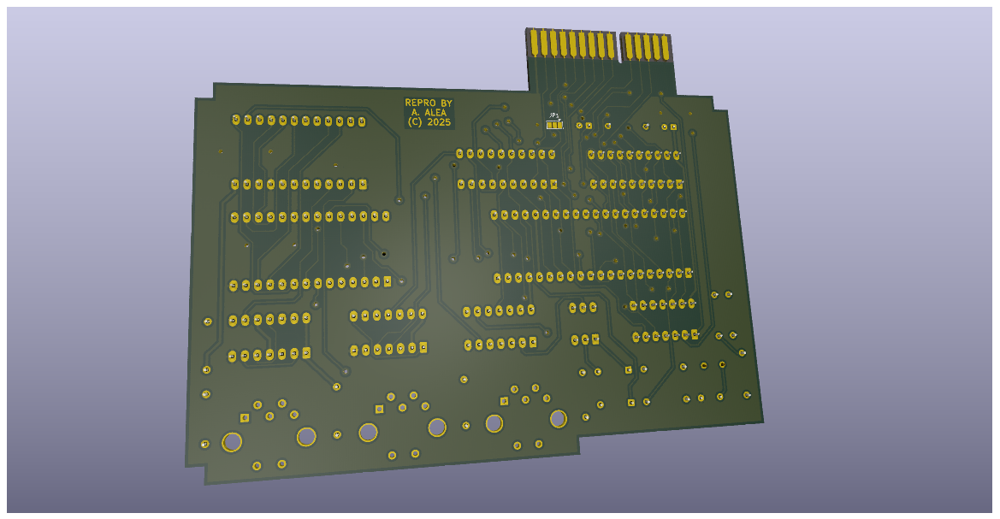

# Miracle MIDI Interface for QL
A reverse engineering exercice using the Sinclair QL Midi Interface as target

Licensed under Cern OHL-S - https://ohwr.org/cern_ohl_s_v2.txt

## WARNING: DO NOT USE THIS PROJECT IS NOT TESTED AND MISSING THINGS

This is not a functional item, it's only a exercice to reinforce my skills in Kicad EDA Software.

This project match schematic found on internet of the interface.

## Information
There is very few information about this interface.
Only 1 picture has been found on internet, and none of the internals of the interface.

There is information indicating that the interface is buggy and do not work well.

There is also information about a software and hardware patch to be able to work with super gold card.

There is only one software (with source code) available for this interface.

## Comparative

